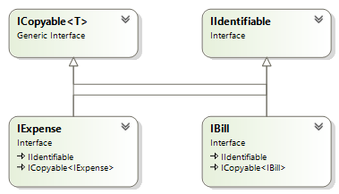
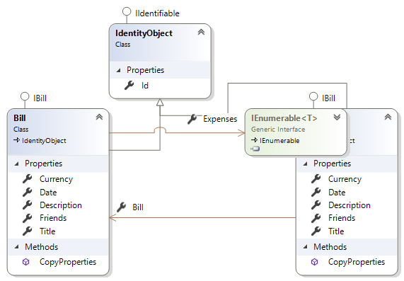

# BillShare (Domainname: BillShare)
Beschreibung vom Projekt.  
Das ist eine neue Zeile.  
Eine Auflistung kann wie gefolgt
erstellt werden:  
+ **Schritt1:**
+ **Schritt2:**
+ *Schritt3:*  

Ein Programmabschnitt kann auch 
eingefügt werden. Dazu verwende folgende
Syntax:  
```csharp
public class Person
{
    public string Firstname {get;set;}
}
```

## Projektstruktur erstellen
+ **Schritt 1**  
Projektname überlegen und mit diesem
Namen eine 'Solution' erstellen
+ **Schritt 2**  
Eine Klassenbibliothek 'CommmonBase' erstellen. In dieser Bibliothek werden alle Algorithmen, welche unabhängig vom Domain-Bereich sind, gesammelt.  
+ **Schritt 3**  
Eine Klassenbibliothek für die Schnittstellen anlegen. Der Projektname wird wie folgt definiert: [Domainname].Contracts.  
+ **Schritt 4**  
EIne Klassenbibliothek für die Geschäftslogik. In diesem Projekt werden alle Geschäftsprozesse gesammelt. Projektname wird wie folgt definiert:[Domainname].Logic  
+ **Schritt 5**  
Erstellen einer Konsolenanwendung zum Testen der Struktur. Projektname wird wie folgt definiert: [Domainname].ConApp  
**Hinweis:** Im weiterem Ausbau werde noch weitere Projekte hinzugefügt (z.B: Rest-Service).
+ **Schritt 6**  
Abhängigkeiten definieren.
## Projekt: Schnittstellen

### Schnittstellen definieren



##Projekt: Logik

### Entitäten definieren


### Weitere Aktionen

Folgende NuGet-Packages hinzufügen:
+ **Microsoft.EntityFrameworkCore**
+ **Microsoft.EntityFrameworkCore.SqlServer**
+ **Microsoft.EntityFrameworkCore.Tools**

Wenn die Migration verwendet wird, dann muss zur Konsolen-Anwendung das folgende
  Nuget-Paket hinzugefügt werden: 
+ **Microsoft.EntityFrameworkCore.Design**
